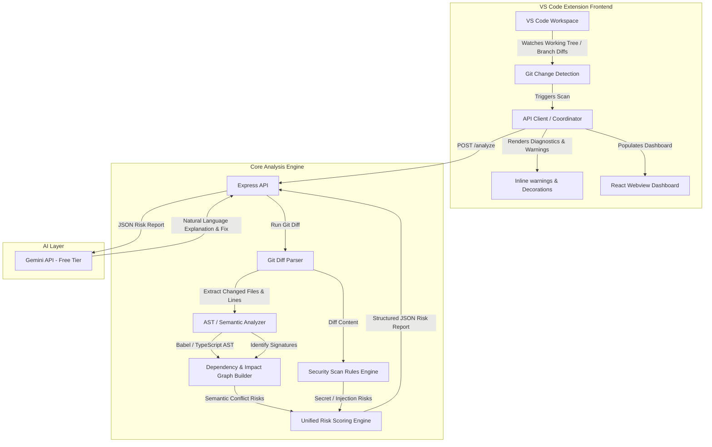

# CodeGuard — System Architecture

This document describes the high-level system architecture, data flow, and components of CodeGuard.

## 1. System Overview

CodeGuard is an AI-powered git conflict and security intelligence platform. It consists of a VS Code Extension frontend that communicates with a local Core Analysis Engine and the Google Gemini API to analyze Git diffs in real-time, predict semantic integration conflicts, identify security risks, and provide plain-English explanations and remediation recommendations.

## 2. High-Level Architecture Diagram

## 3. Data Flow

1. **Triggering**: A developer saves a file or performs a git action. The VS Code extension detects working tree changes.
2. **Parsing Diffs**: The extension makes an API request to the backend server sending the current changes. The backend parses `git diff` output to identify the modified files and line ranges.
3. **Semantic Code Analysis**: The AST parser analyzes modified lines, resolving changes to functions, class definitions, and imports.
4. **Impact Mapping**: The dependency graph builder maps imports and function references to identify calls to the modified functions in other parts of the repository (cross-file analysis).
5. **Security Scanning**: A patterns/regex rules engine scans modified lines to detect secrets (API keys, credentials) and unsafe execution patterns (eval, SQL injection, unsanitized commands).
6. **Risk Aggregation**: The scoring engine evaluates findings from the Semantic Analyzer and Security Scanner to grade issues (Low, Medium, High, Critical).
7. **AI Enrichment**: The structured JSON payload is formatted into a prompt and sent to the Gemini API (`gemini-2.5-flash`). Gemini generates a concise explanation of the risk and actionable remediation instructions.
8. **UI Presentation**: The structured JSON response, now enriched with AI recommendations, is returned to the VS Code extension which highlights lines inline via the Diagnostics API and displays a full summary inside the React webview dashboard.

## 4. Subsystem Components

### 4.1 Client Layer (VS Code Extension)
- **Git Detector**: Monitors workspace changes using the VS Code `WorkspaceWatcher` and native Git extension API.
- **Diagnostics Provider**: Interacts with VS Code `languages.createDiagnosticCollection` to show squiggly lines and tooltips on affected code lines.
- **Webview Dashboard**: A React-based web panel that lists all active repository-wide risks.

### 4.2 Core Engine Layer (Local Backend API)
- **AST Parser Module**: Resolves changed lines back to AST coordinates. Supports JavaScript/TypeScript using `@babel/parser`.
- **Dependency Graph Engine**: Maintains a lightweight in-memory directory graph of caller/callee relations across the codebase.
- **Security Engine**: Implements rules for detecting hardcoded secrets and vulnerable code structures.

### 4.3 AI Layer
- **Client Wrapper**: Integrates the `@google/generative-ai` SDK.
- **Context Optimizer**: Redacts/masks secrets before sending snippets to the Gemini API to prevent data leaks.
- **Prompt Architect**: Combines system architecture metadata and changes to format a clean query context for `gemini-2.5-flash`.
