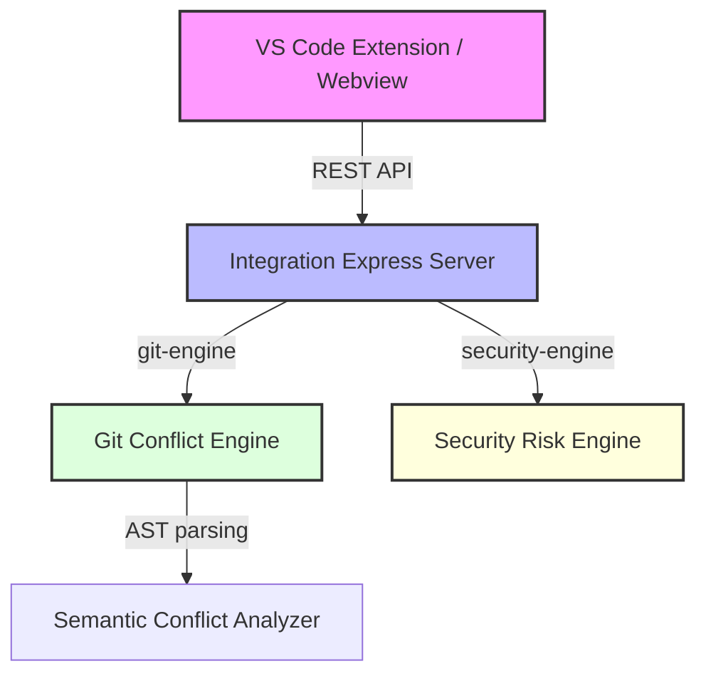

# ConflictLens Integration & Semantic Engine Documentation

Welcome to the unified ConflictLens repository! This document serves as the guide for judges and developers to understand the integration structure, implementation details, and verification steps.

---

## 1. Project Architecture

ConflictLens is a multi-package monorepo structured using NPM Workspaces:



### Module Structure
- `shared/` (`@codeguard/shared`): Canonical TypeScript types and structures ensuring identical data contracts between extension front-end, Express server, Git analyzer, and Security scanner.
- `packages/git-engine/` (`@codeguard/git-engine`): High-efficiency git-level diff analyzer, conflict detector, and AST semantic conflict analyzer using Babel.
- `backend/` (`@conflictlens/backend`): Security scanning suite (injection attacks, API credentials leaks) and the integration Express server running on port `3000`.
- `extension/`: The VS Code extension, featuring React-based Webview dashboard and Gemini AI client-side masking.

---

## 2. Phase 5 — Semantic/AST Conflict Detection

In addition to traditional git-overlap conflict heuristics, ConflictLens implements an **AST Semantic Analyzer** in `packages/git-engine/src/core/semantic/`.

### Implementation Details:
1. **Signature Extraction (`SignatureAnalyzer.ts`)**: Uses Babel parser to extract functions, classes, and methods, mapping them to their formal signatures (names, default values, params, rest params).
2. **Dependency Graph Builder (`DependencyGraph.ts`)**: Walks the AST matching imports/requires and function calls to detect calling files and line numbers.
3. **Cross-Branch Signature Comparison (`SemanticAnalyzer.ts`)**:
   - Analyzes differences between the merge base version and branch A.
   - Identifies changed function signatures (e.g. added/reordered/removed arguments).
   - Scans branch B for any callers invoking those modified functions without updating their arity.
   - Flags these as **HIGH** or **CRITICAL** semantic risk conflicts (even if there are no overlapping line modifications).

---

## 3. Demo Scenario Verification

We have validated the demo scenario specified in PRD §8:
- **Base (main)**: `utils.js` defines `calculateTotal(price, tax)`.
- **Branch A**: Changes signature to `calculateTotal(price, tax, discount)`.
- **Branch B**: Calls `calculateTotal(price, tax)` with 2 arguments.
- **Result**: System successfully flags a `high` risk semantic conflict mapping to `checkout.js` call sites.

---

## 4. Run & Test Instructions

### Workspace Commands:
- Run all tests across workspaces:
  ```bash
  npm test
  ```
- Build the entire monorepo:
  ```bash
  npm run build
  ```
- Run the local integration server in dev mode:
  ```bash
  npm run dev:server --workspace=@conflictlens/backend
  ```
